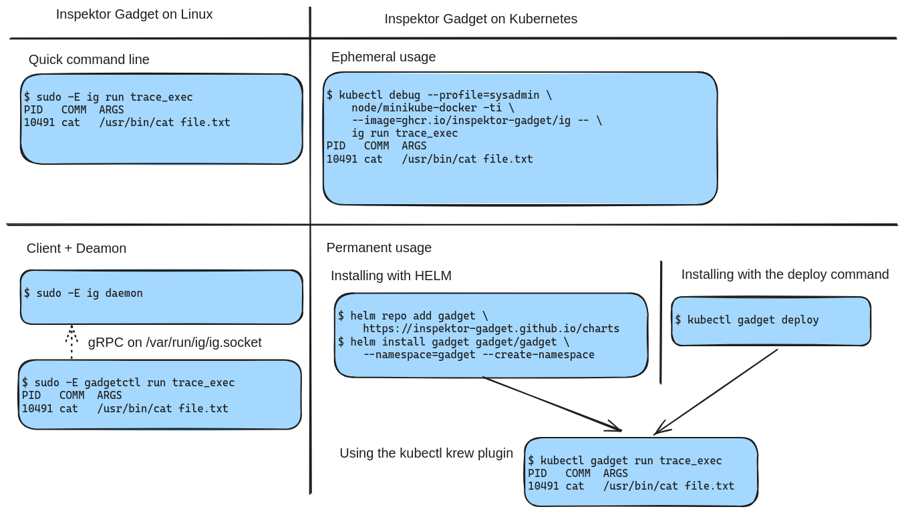

Inspektor Gadget can be used either on a Linux machine or on Kubernetes. It
supports both ephemeral commands and permanent installation.




<!-- toc -->
- [Quick Start on Kubernetes](#quick-start-on-kubernetes)
- [Quick Start on Linux](#quick-start-on-linux)
- [Next Steps](#next-steps)
<!-- /toc -->

We can quickly try out Inspektor Gadget without installing by using [`ig`](../ig.md) as follows:

## Quick Start on Kubernetes

We can use [kubectl node debug](https://kubernetes.io/docs/tasks/debug/debug-cluster/kubectl-node-debug/) to run `ig` on a Kubernetes node:

```bash
$ kubectl debug --profile=sysadmin node/minikube-docker -ti --image=ghcr.io/inspektor-gadget/ig -- ig trace exec
Creating debugging pod node-debugger-minikube-docker-c2wfw with container debugger on node minikube-docker.
If you don't see a command prompt, try pressing enter.
RUNTIME.CONTAINERNAME          PID              PPID             COMM             RET ARGS
k8s_shell_shell_default_b4ebb… 3186934          3186270          cat              0   /bin/cat file
```

For more information on how to use `ig` without installation on Kubernetes, please refer to the [ig documentation](../ig.md#using-ig-with-kubectl-debug-node).

## Quick Start on Linux

We can use `docker run` to run `ig` on a Linux host:

```bash
$ docker run -ti --rm \
    --privileged \
    -v /:/host \
    --pid=host \
    ghcr.io/inspektor-gadget/ig \
    trace exec
RUNTIME.CONTAINERNAME    PID        PPID       COMM             RET ARGS
heuristic_yonath         3329233    3329211    ls               0   /bin/ls
```

For more information on how to use `ig` without installation on Linux, please refer to the [ig documentation](../ig.md#using-ig-in-a-container).

## Next Steps

If you want to install Inspektor Gadget to inspect your entire Kubernetes cluster or using a static binary on a Linux node, you can follow the installation instructions:
- [Installing on Kubernetes](install-kubernetes.md)
- [Installing on Linux](install-linux.md)
